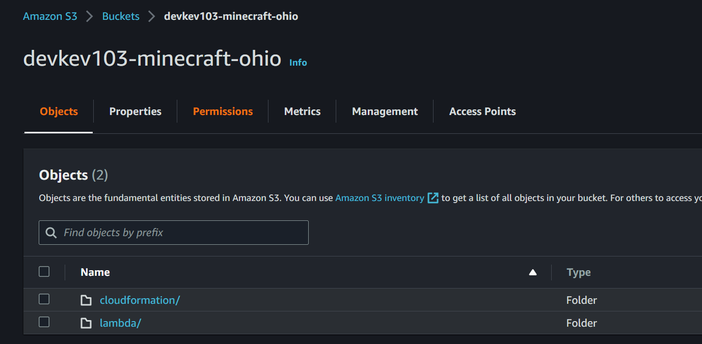

- [EC2 Minecraft](#ec2-minecraft)
  - [Side Note](#side-note)
  - [First Steps: Creating an S3 Bucket](#first-steps-creating-an-s3-bucket)
  - [Creating a Key Pair](#creating-a-key-pair)
  - [Creating the VPC and EC2](#creating-the-vpc-and-ec2)
  - [Extra Configuration](#extra-configuration)
    - [EC2 Instance Connect](#ec2-instance-connect)
  - [Common Questions](#common-questions)
    - [How to Connect to the Minecraft Server](#how-to-connect-to-the-minecraft-server)
    - [How Much Will This Cost Me?](#how-much-will-this-cost-me)
    - [What is the Server Capacity?](#what-is-the-server-capacity)
    - [I Want to Completely Delete Everything](#i-want-to-completely-delete-everything)
    - [How Secure is this Server?](#how-secure-is-this-server)
    - [My Minecraft Server is Not Starting](#my-minecraft-server-is-not-starting)
  - [TODO!](#todo)


# EC2 Minecraft #

Welcome to the repository for creating an EC2 Minecraft server! This guide assumes you are completely new to EC2 and AWS in general. Let's get started!

## Side Note ##

As a side note, if you are already familiar with VPC, Subnetting, Security Groups, and Cloudformation, you can use the `create-minecraft-ec2.json` stack to just create the EC2 instance and none of the other infrastructure.

## First Steps: Creating an S3 Bucket ##

Create an AWS account and log in. Once logged in, change your region (top right-hand corner) to be as close as possible to where you live. This will reduce latency for your connection to the server.

Go to the CloudFormation Service - this is where we will be creating the infrastructure we need. 

Create Stack -> Select Upload Template -> Choose file "create-minecraft-s3-bucket.json"

Fill in a stack name of "Creation-of-S3-[BUCKET NAME]"

The only parameter is BucketName. Fill this in with an **all lowercase** name. Next -> Next -> Submit.

Once that is done creating, make your way over to the S3 service and check out your new bucket. In your new bucket upload the folders "cloudformation" and "lambda". In the end, you will have something like this 



Before heading to the next step, copy the URL object for `top.json` and save it for a later step, should be something like this `https://devkev103-minecraft-ohio.s3.us-east-2.amazonaws.com/cloudformation/top.json`

## Creating a Key Pair ##

Go into the EC2 Service and look for `Key Pair`. Create a new key pair with options `RSA` and `.ppk` with whatever name you want. **Do not** lose or share this!! This is how you will access your server with SSH.

## Creating the VPC and EC2 ##

Head back over to CloudFormation, and paste the copied URL into the parameter field "Amazon S3 URL". Next -> Next -> Check the two "I acknowledge that AWS CloudFormation ..." -> Submit.

It will take approximately 5 minutes and then you will then have your Minecraft server ready to go!

## Extra Configuration ##

### EC2 Instance Connect ###

Follow [this](https://repost.aws/knowledge-center/ec2-instance-connect-troubleshooting) guide on how to set up/troubleshoot EC2 Instance Connect.

If you have been following this guide, edit Inbound Rules for the Minecraft Security Group, and add an SSH rule from an AWS IP. 

```powershell
# get AWS IP range here; be sure to specify your specific region
Get-AWSPublicIpAddressRange -Region us-east-2 -ServiceKey EC2_INSTANCE_CONNECT | select IpPrefix
```

## Common Questions ##

### How to Connect to the Minecraft Server ##

You will need the public IP address for the EC2 instance you created. In the Minecraft launcher, you will use the server's public IP address as "Server Address". You can find the server's public IP address in the EC2 console under `Public IPv4 address`

### How Much Will This Cost Me? ###

The instance running will cost you [approximately $0.09 per hour](https://aws.amazon.com/ec2/pricing/on-demand/). **When you are done playing on the server, shut it down to save money.**

### What is the Server Capacity? ###

From my experience, two people at one time played fine on the server. I have never tried more than two.

### I Want to Completely Delete Everything ###

Head over to the CloudFormation Service in the region you created your stack. And delete the root of the stack, this will delete **most** resources provisioned by this CloudFormation stack.

The route table will fail to delete because it is the main route table for the Minecraft VPC. You can get around this by deleting it by deleting the root node of the Cloudformation stack twice.

**BEWARE**: If you delete the Cloudformation Stack it will also delete the world!

### How Secure is this Server? ###

**If** you fill out `<YOUR PUBLIC IP>/32` in the CloudFormation template, only you can get to this server either for SSH'ing or connecting with the Minecraft launcher.

### My Minecraft Server is Not Starting ###

Did you remember to accept the EULA agreement? If you did, execute this command to see the status and tail of the log for the `minecraftserver.service`

```bash
systemctl status minecraftserver
```

You can also try to start the server manually with `java -Xmx7G -Xms1G -jar /usr/local/minecraft/server.jar nogui;`

## TODO! ##

* add a way to deploy with cli/powershell
* add a mechanism to shutoff/turn on the instance
* configure better security practices for IAM - Least Privilege Strategy
* break out Security Groups into their own stack for reusability
* The service and start.sh are embedded into the Cloudformation stack - download them from a repository instead
* separate disk for Minecraft data